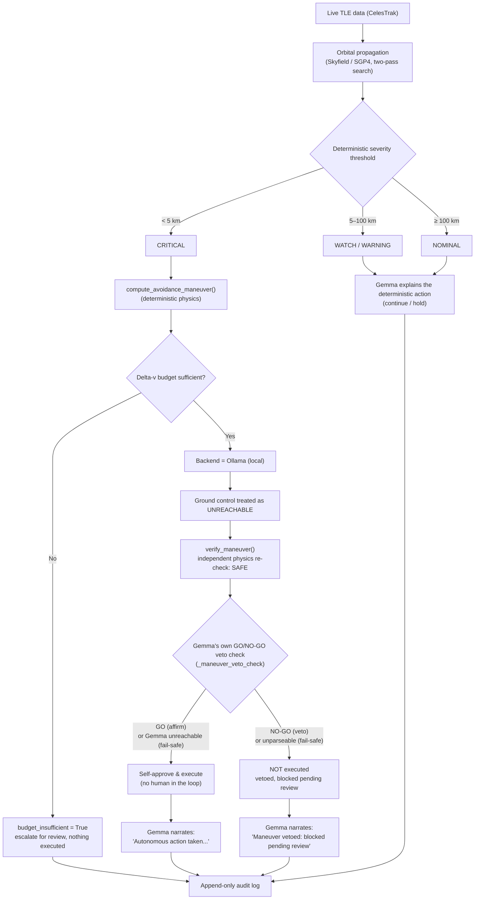
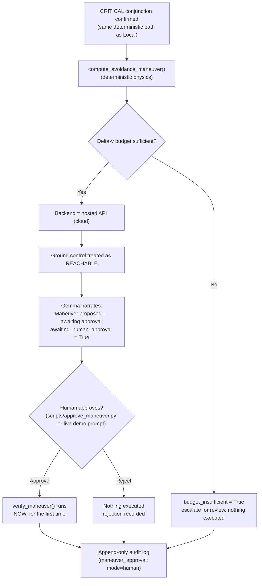

# Deep Space Navigation — Orbital Collision Avoidance

*Track 2 submission — Build with Gemma: Triage in Light Speed*

**Built with:** Python, [LangGraph](https://langchain-ai.github.io/langgraph/)
(pipeline orchestration), [Pydantic](https://docs.pydantic.dev/) (schema
validation), [Skyfield](https://rhodesmill.org/skyfield/)/SGP4 (real orbital
mechanics), [Ollama](https://ollama.com) (local Gemma) and a hosted
Gemini-style API (cloud Gemma), [Rich](https://rich.readthedocs.io/) (terminal UI),
[Streamlit](https://streamlit.io) (live mission-ops dashboard),
[Plotly](https://plotly.com/python/) (real 3D orbit visualization).

## The problem

Low Earth orbit is getting crowded. Thousands of tracked objects — active
satellites and debris from past collisions and breakups — are constantly
passing close to one another. A mission controller can't manually
evaluate every close approach in real time, but a wrong or opaque
automated call in this domain is genuinely dangerous: a missed collision
is catastrophic, a false alarm burns limited fuel, and a maneuver decision
nobody can explain afterward is a decision nobody can trust.

There's a second, quieter problem underneath that one: **ground control
isn't always reachable.** Light-speed delay and communication blackouts
are real constraints for anything operating in deep space — a probe often
has to decide *now*, not "as soon as someone signs off." A system that
only works when a human is watching isn't actually a deep-space system.

This project is an attempt to solve both problems in the same design:
**decisions that matter (is this dangerous? what should happen?) are made
deterministically, not by the AI** — and Gemma's job is to explain those
decisions in plain language, narrate what's happening, and — depending on
whether ground control is actually reachable — either report a completed
autonomous action, or clearly propose one and wait for a human.

## How it detects a collision risk

### The data

Real satellite/debris tracking data (TLEs — Two-Line Elements) is fetched
live from [CelesTrak](https://celestrak.org), by default from two real,
meaningfully different groups screened **against each other**: `stations`
(real crewed stations — ISS, Tiangong, ...) and `cosmos-2251-debris`
(real fragments from the 2009 Cosmos 2251/Iridium 33 collision, one of
the largest debris-generating events in orbit). Cross-screening both
answers the question that actually motivates collision avoidance — *is a
real active spacecraft at risk from real tracked debris?* — rather than
only debris-vs-debris. Nothing here is synthetic data dressed up as real;
the WATCH/NOMINAL/WARNING conjunctions you'll see in a demo run are
genuine predictions against objects that are actually up there right now.

Every pairwise conjunction across both groups is screened, not just a
handful — on a real ~120-object combined sample that's several thousand
pairs, checked end-to-end (including the live network fetch) in well
under a second. Naively re-propagating every pair from scratch doesn't
scale to that (measured at ~9.6s for just 1770 pairs during development);
each object's approximate trajectory is computed once and reused across
every pair it appears in, and only the closest candidates by that
estimate get the expensive precise refinement. See `PHASE_PROGRESS.md`
Phase 10 for the full performance approach and the two real issues
(docked-vehicle noise, a dense debris field crowding out cross-group
results) caught by actually running this live against CelesTrak, not just
in unit tests.

### The physics

Each pair of tracked objects is propagated forward with
[Skyfield](https://rhodesmill.org/skyfield/)'s SGP4 implementation — the
standard model for TLE-based orbit propagation — over a 48-hour lookahead
window. Finding the true closest approach isn't a single calculation: a
coarse sweep (5-minute steps) first brackets roughly where the minimum
separation falls, then a fine sweep (10-second steps) refines it within
that narrow window. This two-pass approach exists because a flat,
fixed-step sample can only ever find an *upper bound* on the real minimum
— the actual closest point can fall between samples. Relative velocity at
closest approach comes out of the same calculation.

### Turning physics into a decision

Severity is a **plain distance threshold**, not a model judgment call:

| Minimum predicted separation | Severity | Action |
|---|---|---|
| < 5 km | CRITICAL | abort (maneuver — see below) |
| 5 – 25 km | WARNING | hold |
| 25 – 100 km | WATCH | continue |
| ≥ 100 km | NOMINAL | continue |

Confidence isn't a fixed number either — it's derived from how *stale* the
underlying tracking data is (TLE epoch age): fresher data means a higher
confidence score, aging past a week drops it sharply. Gemma is only
brought in **after** severity and action are already decided, to turn the
raw numbers into a plain-language summary a person can actually read.

For a CRITICAL conjunction specifically, a simplified avoidance maneuver
(direction + delta-v) is computed deterministically, then checked twice
before being called verified: re-deriving the resulting clearance forward
from that delta-v (not just trusting the number it was solved for), and
a plausibility bound on the delta-v itself. Only the second one is
actually independent — a QA pass found the first is the algebraic
inverse of the original solve, so it's mathematically guaranteed to
agree and can only ever catch an implementation bug, not a bad maneuver.
See `src/maneuver.py:verify_maneuver`'s docstring and `PHASE_PROGRESS.md`'s
QA pass entry.

**Why there's a delta-v budget.** A real spacecraft doesn't have
unlimited fuel — it can't fire an avoidance maneuver every time one is
merely convenient. `DeltaVBudgetTracker` (`src/maneuver.py`) tracks a
starting delta-v allowance (`DELTA_V_BUDGET_M_S`, default 5.0 m/s) that
decrements every time a maneuver actually executes; when it can't cover a
new maneuver, `budget_insufficient` gets set to `True`. When a CRITICAL
maneuver can't be afforded, the system doesn't pretend to
have infinite fuel, and it doesn't fail silently either — the maneuver
plan stays visible (so a human can see what *would've* been needed),
`verified_clearance` stays empty (nothing was actually applied), and
Gemma's explanation says plainly that the maneuver was calculated but not
executed, and escalates for review. Failing transparently, not silently
or dishonestly, is the whole point.

## Two decision paths: local autonomy vs. cloud-gated approval

The one piece of this system that genuinely *is* a judgment call — should
this maneuver execute right now, or should a human sign off first — is
resolved by which Gemma backend is configured, used deliberately as a
stand-in for whether ground control is reachable:

- **Local (Ollama)** → ground control **unreachable** → a deterministic
  physics check independently verifies the maneuver is safe, then **Gemma
  itself gets those same numbers and issues a real GO/NO-GO verdict**,
  standing in for the unavailable human — no person in the loop.
- **Cloud (hosted API)** → ground control **reachable** → the maneuver is
  calculated and budget-checked, but held pending until a human explicitly
  approves or rejects it.

This is the one place Gemma's role genuinely changes between the two
paths. Everywhere else it never decides the physics, only narrates the
current state. On the local path specifically, Gemma *does* make a real
judgment call — but a tightly bounded one: it can only make the outcome
**more** conservative than the physics check, never less. It can veto an
already-verified-safe maneuver; it can never approve one the physics
hasn't already cleared. An unparseable verdict fails safe to NO-GO
(escalate), and Gemma being unreachable is *not* treated as a veto — an
LLM outage alone shouldn't block a maneuver already proven safe, so that
case still executes autonomously on the physics check alone.

### Path 1 — Local (Ollama): autonomous

The veto check's GO/NO-GO verdict is requested as real JSON-schema-
constrained output from Ollama (`{"verdict": "GO"|"NO-GO", "reason": ...}`,
confirmed directly against this project's own model before relying on
it), not parsed out of free text - real constrained decoding, so the
response is guaranteed to match that shape rather than hoping a regex
scan finds the right token. The original free-text scan
(`_parse_veto_verdict`) still exists as a fallback for the one case
structured output can't cover: `GemmaClient.generate()`'s own
cross-backend fallback landing on the hosted API mid-call (if Ollama is
briefly unreachable), which has no equivalent schema-constraint support
wired up here and returns plain text instead.

### Path 2 — Cloud (hosted API): human-in-the-loop

Both paths converge on the same audit log format — every entry records
whether its explanation actually came from Gemma or a deterministic
fallback, which backend produced it, and (for CRITICAL cases) whether the
maneuver was autonomous, human-approved, rejected, or blocked by budget.
Nothing about *how* a decision was reached is hidden after the fact.

## Reliability layers: retry, failover, fallback, and review

Two more safety nets exist independently of the local/cloud approval
split above — worth calling out explicitly since they're easy to
conflate with it or with each other.

**Getting an explanation out of Gemma, in three tiers.** A single Gemma
call first retries once on the *same* backend (a transient hiccup
shouldn't force an immediate escalation). If that still fails,
`GemmaClient` **fails over** to the *other* configured backend (local ↔
cloud) and retries there. If *both* backends are unreachable, the
pipeline falls through to a **deterministic fallback** — a plain
templated sentence with no AI involved at all — so a finding or decision
is never silently dropped just because Gemma happens to be down. Every
logged entry records exactly which of these actually happened
(`GemmaProvenance.source`: `"gemma"` or `"fallback"`, plus `model_used`
naming the real backend/model that responded, even when it wasn't the one
originally configured).

**Two different kinds of "human," not one.** `human_reviewed` /
`reviewed_by` is a **post-hoc audit sign-off** — it can be applied to
*any* logged decision, at any time, after the fact (`scripts/mark_reviewed.py`).
It doesn't block or gate anything; it just records that a person looked
at it. `maneuver_approval` / `awaiting_human_approval` is a completely
different mechanism — a **pre-execution gate** that exists only for
CRITICAL maneuvers on the cloud backend, and actively prevents
`verify_maneuver()` from ever running until a person explicitly approves
or rejects it (`scripts/approve_maneuver.py`). A single decision can carry
both, neither, or just one of these — they're independent, and only one
of them (approval) can stop an action from happening.

**A circuit breaker, so an extended outage doesn't keep paying full
price.** The three-tier retry above already handles a transient hiccup —
but if a backend is down for an extended stretch, every single
subsequent event would otherwise still pay the full retry+timeout cost
against a backend already known to be unreachable. `GemmaClient` tracks
CONSECUTIVE failed `generate()` calls per backend (not raw HTTP
attempts — one count per real-world event that found the backend down);
after 3 in a row, that backend's circuit "opens" and real attempts
against it are skipped entirely for a 60-second cooldown, falling
straight through to cross-backend failover (or the deterministic
fallback) instead. A single success resets the count to zero, and once
the cooldown elapses the next call gets a real "half-open" probe — if
Ollama comes back, the very next event notices for real, not after some
fixed longer wait. A QA pass found the breaker couldn't actually engage
in practice at first — every dashboard button and demo step let a fresh
`GemmaClient` get created per call, resetting the counter every time —
so both `scripts/dashboard.py` and `scripts/run_demo.py` now hold and
reuse ONE client across their whole session/run, verified live against
a real unreachable host: the failure count climbed 1, 2, 3, then held
at 3 on a 4th call instead of incrementing, proving the real network
attempt was genuinely skipped.

**The audit trail now includes what was actually asked, not just what
came back.** `GemmaProvenance` already recorded which backend/model
responded and how long it took; it now also carries the real prompt
text sent for that specific call. Every real Gemma call this project
makes goes through one function (`pipeline._call_gemma_with_provenance`),
so this was a single change point — and it's populated even when the
deterministic fallback is what actually gets used, since the real
question was still genuinely asked (and unanswered), which is itself
worth being able to reconstruct later.

## Live dashboard

`streamlit run scripts/dashboard.py` opens a browser-based mission-ops
view over the exact same append-only audit log the CLI writes to — not a
mock, not a second copy of the pipeline's decision logic:

- **Metrics row** — totals by state: executed autonomously, executed
  after human approval, vetoed by Gemma, rejected by a human, still
  awaiting approval, blocked by budget.
- **Pending human approval inbox** — every CRITICAL maneuver currently
  awaiting a decision, with real Approve/Reject buttons wired to
  `DecisionLogger.approve_maneuver` — clicking one actually resolves it,
  the same way `scripts/approve_maneuver.py` does. A stale page, a
  double-click, or a race with another operator or the CLI scripts
  raises a real `ValueError` (already resolved, budget-blocked, not
  CRITICAL) — caught and shown as a clean message, not a raw traceback.
- **Full decision table** and an **inspect/mark-reviewed panel** for any
  logged decision, wired to `DecisionLogger.mark_reviewed` (same
  error-handling treatment as Approve/Reject above).
- **Orbit plot** — for any real celestrak-sourced event, a real 3D view
  of both objects' actual propagated trajectories (Earth to scale, a
  closest-approach marker) plus a distance-vs-time chart with severity
  thresholds drawn in, built by re-fetching each object's current TLE and
  re-propagating with the same physics `src/orbital.py` already uses -
  see below.
- **Live tracking view** — real current positions (not a triage result)
  for CelesTrak's `stations` group, on the same style of 3D globe - see
  below.
- **Ask about the mission log** — real retrieval-augmented search over
  this exact audit log (local Ollama embeddings, real cosine-similarity
  ranking, Gemma answering from only the retrieved entries) - see below.
- **Trends** — severity mix per real day, recurring real objects across
  scans, and Gemma-vs-fallback rationale mix over time, aggregated from
  the real accumulated log - see below.
- Five sidebar actions generate real new activity without leaving the
  browser: fetching live CelesTrak conjunctions (the same cross-group
  screening described above), running the synthetic CRITICAL fixture,
  replaying a real historical collision, screening a real debris group
  for decay/re-entry risk, and running the synthetic attitude/pointing-
  loss scenario (see below for all three hazard types).

The dashboard's maneuver-state classification (which of the six states a
decision is in) reuses the exact same `classify_decision_status` function
the terminal renderer uses — the two views are structurally incapable of
disagreeing with each other about what state a decision is in.

### Orbit plot: seeing the real trajectories, not just the numbers

Selecting any `source="celestrak"` event in the inspect panel and
clicking "Generate orbit plot" re-fetches both objects' CURRENT TLEs by
NORAD catalog number and re-propagates them with the exact same
coarse-pass functions (`orbital.build_coarse_times`,
`orbital.compute_coarse_positions`) the real screening pipeline already
uses - no separate, duplicated physics. Renders a real interactive 3D
Plotly view (Earth drawn to scale, both objects' actual propagated
paths, a marker at the closest-approach point) and a distance-vs-time
chart with this project's own severity thresholds drawn as reference
lines.

Deliberately unavailable for synthetic or historical events - synthetic
fixtures have no real orbital elements, and (as established in Phase 12)
CelesTrak's public API only ever serves *current* TLEs, so a historical
event has no real archival trajectory to re-propagate either. The panel
says so explicitly rather than fabricating a plausible-looking plot.
Because it re-fetches *current* TLEs rather than the exact epoch that
produced the originally-logged `min_distance_km`, the plotted closest
approach can differ from what was logged at decision time - a live
recomputation, not a replay of the original numbers, and the UI says
that explicitly too.

### Live tracking: what's actually up there right now

The orbit plot answers "where were these two objects relative to each
other" for a specific past triage result. "Show live positions" answers
a different question - "where are the real, named assets right now" -
independent of any logged event. It fetches CelesTrak's `stations` group
(real crewed stations - ISS, Tiangong - plus their currently-docked
visiting vehicles) and computes each object's real current position with
a single Skyfield/SGP4 evaluation at "now" (`src/live_positions.py`),
then plots it on the same style of scale-reference Earth globe the orbit
plot uses.

Deliberately scoped to the `stations` group specifically, not an attempt
at rendering the full ~20,000-object public catalog: it's the exact same
"asset actually worth protecting" set `CelesTrakAdapter` already treats
as the real payload of this whole project (see its module docstring) - a
small, named, recognizable set of real objects, not an unreadable point
cloud of anonymous debris fragments.

### Ask about the mission log: retrieval-augmented search, not fine-tuning

Every other view in this dashboard is either a triage result (a
conjunction, a decay finding) or a snapshot (live positions). "Ask about
the mission log" is different: it answers plain-English questions about
the log itself - "which CRITICAL events were vetoed and why?" - by
actually retrieving the real relevant entries, not by guessing.

How it works (`src/rag.py`): every logged decision's real fields
(subject, severity, action, rationale, approval state) get embedded via
a local Ollama embedding model (`nomic-embed-text` by default -
`GEMMA_EMBED_MODEL`), cached to disk keyed by `event_id` so an unchanged
log doesn't get re-embedded on every query. The question gets embedded
the same way, real cosine similarity ranks every entry against it, and
only the top-K most relevant real entries are handed to Gemma as
context - with an explicit system instruction to answer ONLY from those
entries, never from outside knowledge, and to say so if they don't
contain enough information. The UI shows which real `event_id`s the
answer was grounded in, so the grounding is checkable, not just claimed.

This is deliberately retrieval, not model fine-tuning: fine-tuning a
model on this log's (finding → rationale) pairs was considered and set
aside as a real but separate ML effort (dataset curation, a training
pass, an evaluation harness) - retrieval gets most of the practical
benefit (answers grounded in this system's own real history) using only
data that already exists and infrastructure (Ollama) already running.

Local-only by design: embeddings always go through Ollama regardless of
which `GEMMA_BACKEND` is configured for narration elsewhere, since the
hosted Gemini-style API has no embedding endpoint wired up here - a
reachable local Ollama is required for this specific feature even on an
otherwise cloud-configured deployment. Available both in the dashboard
and as a standalone CLI (`python scripts/query_log.py "question"`).

### Trends: what does the accumulated log actually say

Every other dashboard view shows one event (the decision table, the
inspect panel) or one instant (metrics, live tracking). `src/trends.py`
is the first view that looks at the log's own history: a stacked-bar
chart of findings by severity per real day (bucketed by
`decision.made_at`, not `telemetry.timestamp` - see below), a table of
which real objects keep showing up across separate scans (ranked by
appearance count, covering both conjunction pairs and single-object
hazards), and a chart of how much narration each day genuinely came
from Gemma versus the deterministic fallback - a day where fallback
spikes is a real signal that Gemma was unreachable a lot that day, not
just a cosmetic detail.

Pure data transforms, no Streamlit dependency (same separation
`dashboard_data.py` already established) and no new network/AI calls -
purely aggregating what every other phase already logged.

**A QA pass found two real gaps here, both fixed.** First: the two trend
charts were aggregating every logged entry indiscriminately, mixing real
CelesTrak scans with synthetic demo fixtures and the repeated historical
replay - after a demo's been run a few times, the CRITICAL bar for
"today" could be almost entirely synthetic noise, contradicting this
project's own documented finding that real data rarely lands in
CRITICAL. Both charts now filter to `is_real_live_source()` entries only
(real `"celestrak"`/`"celestrak-decay"` scans - synthetic fixtures and
the historical replay excluded), with an explicit caption stating the
real/total counts; live-verified showing "86 of 246 total logged entries
are real" with the chart's Y-axis max dropping from ~140 to ~40 once
filtered. The recurring-objects table still shows everything (real and
synthetic alike - "did I click this demo button 30 times" is still real
information), but every row is now labeled with a `real` column rather
than a synthetic object being visually indistinguishable from a real
one. Second: `recurring_objects` originally grouped by `(object_id,
object_name)` instead of `object_id` alone, which would silently
undercount a real object if its name string ever varied by so much as
whitespace between two fetches - fixed to group by id alone, displaying
the most-recently-seen name.

## Historical replay: would this system have caught a real collision?

Everything else in this project runs on live or synthetic data.
`HistoricalReplayAdapter` (`src/ingestion/historical_adapter.py`) instead
replays a **real, documented** historical conjunction through the exact
same, unmodified pipeline — by default, the 2009 Iridium 33/Cosmos 2251
collision, the first confirmed accidental collision between two intact
satellites, and the same real event the `cosmos-2251-debris` data used
throughout this project traces back to.

The numbers aren't invented. CelesTrak's own historical account
([celestrak.org/events/collision](https://celestrak.org/events/collision/))
documents that its SOCRATES conjunction-screening system predicted a
**584m** closest approach in its final report before the collision
(issued 2009-02-10 15:02 UTC, predicted closest approach ~16:56 UTC the
same day) — and had predicted this same conjunction in **all 14 reports**
issued that week. It just never made the priority list (rank #152 that
day, out of a much larger set of predicted conjunctions industry-wide)
and nobody acted on it. **This was a triage failure, not a detection
failure** — a real, documented example of exactly the problem this
track's name names. NORAD catalog numbers, the ~11.7 km/s relative
velocity, and the ~789 km collision altitude were independently
corroborated against NASA/Wikipedia sources, not taken from one origin.

Feeding that real 584m number into this system's ordinary, unmodified
severity threshold (<5km = CRITICAL) classifies it as CRITICAL and
computes a maneuver — no special-casing for this being a replay. Try it:
`python scripts/run_demo.py` (Step 4) or the dashboard's "Replay
historical event" button.

## A second real hazard: orbital decay / re-entry risk

Every phase before this one was conjunction-specific — even though
`schemas.py`'s own docstring always described `TelemetryEvent`/
`AnomalyFinding`/`Decision` as "intentionally idea-agnostic." This phase
makes that real: `DecayRiskAdapter` (`src/ingestion/decay_adapter.py`)
screens real tracked objects **individually** (not pairs) for orbital
decay/re-entry risk, through the exact same `analyze_node -> decide_node
-> log_node` pipeline every conjunction already goes through — using data
this project already fetches, no new data source, no new credentials.

Skyfield's SGP4 model (the same `EarthSatellite` object already used for
conjunction propagation) already parses real perigee/apogee altitude and
the BSTAR drag term directly from the TLE — confirmed against ISS's real
current TLE before building anything (~414km, the correct real altitude),
so `src/decay.py` needed no separate TLE parser at all. Perigee altitude
alone is the severity signal: it's real, well-established, uncontested
orbital mechanics on its own — an object with a perigee below ~200km
reliably reenters within days to weeks regardless of other factors — not
a precise reentry-time predictor, the same "simplified, clearly labeled,
not flight software" spirit as the maneuver math.

**Deliberately no maneuver machinery for decay, even at CRITICAL.** A
CRITICAL decay finding still gets a real deterministic action and real
Gemma narration, exactly like everything else — just no maneuver plan.
Building a second simplified-maneuver model (a reboost/deorbit planner,
with its own delta-v budget and approval semantics) was explicitly scoped
*out* of this phase, not overlooked: an avoidance burn doesn't mean
anything for "your perigee is too low," and that's a genuinely separate
problem for a future phase, not a small addition to this one.

**One honest number, not tuned around:** with the default real group
(`cosmos-2251-debris`) and these thresholds, live screening currently
tops out at WATCH — the lowest real perigee across the full 598-object
group is ~313km, since the lowest-perigee fragments from the 2009 breakup
already decayed away over the years since. Same "real data rarely
produces the most severe case live" pattern already established for
CRITICAL conjunctions (see Phase 5) — no synthetic fixture was built to
paper over this. Try it: `python scripts/run_demo.py` (Step 5) or the
dashboard's "Screen for orbital decay risk" button.

## A third hazard: attitude / pointing loss (synthetic-only, and openly so)

Conjunctions and decay risk both reuse real CelesTrak TLE data — but
spacecraft **attitude** (which way it's pointing, how fast it's tumbling)
is a genuinely different situation: TLEs encode only orbital position and
velocity, never orientation, and real attitude telemetry is normally
proprietary to each spacecraft's own operator, not published anywhere
analogous to CelesTrak. That's a structural absence, not "real data is
rare on demand" the way a CRITICAL conjunction or CRITICAL decay reading
is — so `SyntheticAttitudeAdapter`
(`src/ingestion/attitude_adapter.py`) is necessarily synthetic-only,
clearly labeled via its `source` field (`synthetic-attitude-fixture`),
the same honesty standard `SyntheticCriticalAdapter` already set for
conjunctions. This was a deliberate design decision, discussed and agreed
before writing any code, not a limitation discovered after the fact.

Same deterministic-severity/Gemma-narrates pattern as every other hazard
type: `classify_attitude_severity` (`src/pipeline.py`) classifies
NOMINAL/WATCH/WARNING/CRITICAL from pointing-error degrees alone (a
spacecraft losing attitude control also typically loses solar-panel
pointing, so power output is carried as a real, correlated supporting
signal — same "one primary threshold, supporting context" design as
decay's BSTAR). Four synthetic readings deliberately span the full
severity range in one demo run, unlike `SyntheticCriticalAdapter`'s
all-CRITICAL design — that design exists specifically to demonstrate
delta-v budget depletion across repeated CRITICAL events, which doesn't
apply here since attitude loss has no maneuver machinery either (an
avoidance burn or a reboost doesn't fix a tumbling spacecraft — real
attitude recovery is reaction-wheel desaturation or thruster-based
detumbling, a genuinely separate problem, explicitly out of scope). A
CRITICAL attitude finding still gets a real deterministic action and
real Gemma narration, exactly like CRITICAL decay risk. Try it:
`python scripts/run_demo.py` or the dashboard's "Run synthetic
attitude/pointing-loss scenario" button.

## Real-time alerting for CRITICAL events

Every earlier phase answered "what happened" - this closes a real
operational gap: right up until this phase, a CRITICAL finding just sat
in the dashboard/audit log until someone happened to look. `src/alerting.py`
fires a real HTTP POST to a configurable webhook (`ALERT_WEBHOOK_URL`)
the moment a CRITICAL decision is logged, from any of the three hazard
types - Slack Incoming Webhook compatible (`{"text": ...}`), so it also
works with Discord, Microsoft Teams, or any custom receiver.

The firing condition is deterministic (`finding.severity ==
Severity.CRITICAL`) - not Gemma's call, the same "Gemma narrates, never
decides" principle as everywhere else in this project. The alert body
reuses the already-generated real Gemma rationale text rather than
making a new Gemma call - no extra latency, no extra cost, and it's the
same explanation a human would already see in the dashboard.

Disabled by default (`ALERT_WEBHOOK_URL` unset is a no-op, not an
error), and a failed send is caught and reported, never raised - an
alerting outage must never block or crash the actual triage pipeline.
Live-verified against a real local HTTP receiver (not just mocks): a
real CRITICAL conjunction produced a real webhook POST with the correct
subject/event_id/action/rationale, and a real WATCH-severity decay
reading produced zero webhook calls.

## What the demo shows, step by step

`python scripts/run_demo.py` walks through all of this live, self-explained,
in order:

1. **Preflight check** — confirms which backend is configured, that it's
   actually reachable right now, and that the log directory is writable.
2. **Real orbital data** — a live CelesTrak fetch across real stations and
   real debris, cross-group screened, and real Skyfield/SGP4 propagation
   — not simulated, and not just a small staged pair.
3. **CRITICAL conjunctions** — synthetic CRITICAL-range events (real data
   rarely lands there on demand) exercising maneuver calculation,
   verification, budget depletion, and — depending on this machine's
   backend — either Gemma's own autonomous GO/NO-GO safety review
   (local) or live human-approval prompts (cloud).
4. **Historical replay** — the real 2009 Iridium 33/Cosmos 2251 collision
   record, fed through the same unmodified pipeline, proving the
   deterministic threshold would have classified it CRITICAL.
5. **A second real hazard** — real objects screened individually for
   orbital decay/re-entry risk, proving the pipeline isn't
   conjunction-specific, with no maneuver machinery even at CRITICAL.
6. **A third hazard type** — synthetic attitude/pointing-loss readings
   spanning the full severity range, since (unlike the first two hazard
   types) no real public data source for spacecraft attitude exists at
   all - clearly labeled, still real deterministic classification and
   real Gemma narration, still no maneuver machinery.
7. **Local/cloud failover** — proves the system recovers automatically if
   its primary Gemma backend becomes unreachable (skipped on a
   local-only machine, so a local demo never makes an unplanned cloud call).
8. **Human review** — marks a logged decision as reviewed, persisted to
   the actual audit file, not just held in memory.
9. **The audit trail itself** — reads back the real, raw, most recent log
   entry, showing every field described above populated for real.
10. **Automated test suite** — the full suite (network-free, mocked Gemma)
    runs live, proving none of the above happened without a safety net.
11. **Summary** — totals: severities seen, Gemma vs. fallback rationale,
    maneuvers executed (autonomous vs. human-approved) vs. blocked vs.
    rejected.

## Field glossary

The diagrams and audit log above use exact field names from the code —
here's what each one means, for reference:

| Field | Meaning |
|---|---|
| `Severity` | `nominal` / `watch` / `warning` / `critical` — deterministic, from distance thresholds |
| `Action` | `continue` / `hold` / `abort` — deterministic, mapped 1:1 from severity |
| `AnomalyFinding.confidence` | 0–1, derived from how stale the TLE tracking data is |
| `ManeuverPlan` | The deterministically computed direction + delta-v for a CRITICAL conjunction |
| `VerifiedClearance` | The independently re-derived post-maneuver separation, and whether it actually clears the threshold |
| `budget_insufficient` | `True` if the maneuver was calculated but couldn't be afforded from the remaining delta-v budget — nothing executed |
| `awaiting_human_approval` | `True` if the maneuver is calculated and affordable, but held pending a human decision (cloud backend only) |
| `ManeuverApproval.mode` | `"autonomous"` (local, no human — may still be a Gemma veto) or `"human"` (cloud, explicit approve/reject) |
| `GemmaProvenance.source` | `"gemma"` (real model output) or `"fallback"` (deterministic text — both backends were unreachable) |
| `GemmaProvenance.prompt` | The real prompt text sent for this specific call — populated even on a `"fallback"` source, since the question was still genuinely asked |
| `veto_provenance` | Provenance for Gemma's own GO/NO-GO maneuver veto-check (local path, CRITICAL only) — `None` when no veto check was attempted |
| `human_reviewed` / `reviewed_by` | Post-hoc audit sign-off — independent of maneuver approval, applies to any decision |
| `object_a_group` / `object_b_group` | Which real CelesTrak group each object came from (e.g. `stations`, `cosmos-2251-debris`) — lets a cross-group "asset vs. debris" conjunction be told apart from a within-group one |
| `last_scan_stats` | `CelesTrakAdapter` instance attribute (not logged per-event) — what a screening call actually covered: `total_objects`, `total_pairs_screened`, `pairs_refined`, `cross_group_pairs_refined` |
| `source` (`TelemetryEvent`) | `"celestrak"` (real conjunction), `"celestrak-decay"` (real decay risk), `"synthetic-critical-fixture"` (synthetic conjunction), `"synthetic-attitude-fixture"` (synthetic attitude/pointing loss), or `"historical-replay"` (real, documented, but historical) — never ambiguous about which |
| `historical_event` / `historical_source` / `historical_actual_outcome` | Only present for historical replays — the citation and real-world outcome travel with the record itself, not just in documentation |
| `perigee_altitude_km` / `apogee_altitude_km` / `bstar` | Only present for decay-hazard events — real orbital elements Skyfield's SGP4 model already parses, not a separate TLE parser |
| `pointing_error_deg` / `angular_rate_deg_s` / `solar_panel_power_pct` | Only present for attitude-hazard events — synthetic (see "A third hazard" above); pointing error alone drives severity, the other two are supporting context |

## Repo hygiene: CI, license, and cleanup

Not a pipeline feature — this is about the repo itself now that the
submission is done. Three small, mechanical changes:

- **A GitHub Actions workflow** (`.github/workflows/tests.yml`) now runs
  the full pytest suite on every push and pull request to `main`. Nothing
  ran the tests automatically before this; a broken change could only
  have been caught by remembering to run `pytest` locally.
- **`.gitignore` now covers the local demo recordings and Claude Code's
  own dev-server launch config** (`local-demo.cast`/`.gif`/`.mp4`,
  `.claude/`) — these were previously just left untracked by discipline
  rather than by the repo actually saying so, which meant nothing stopped
  a future `git add -A` from accidentally picking them up.
- **README now links to the existing `LICENSE` file** (MIT, already
  present since the initial commit but never referenced from anywhere)
  and shows a live test-status badge.

## Summary

- **Real data, real physics.** Live CelesTrak TLEs, Skyfield/SGP4
  propagation, a genuine two-pass closest-approach search — not mocked.
- **Reliability where it matters.** Severity, action, and maneuver math are
  100% deterministic — Gemma never computes or overrides them. The one
  bounded exception is the local-path veto check, and even there Gemma can
  only make an already-verified-safe maneuver *more* conservative, never
  less.
- **An honest autonomy story.** Local vs. cloud isn't just an
  infrastructure choice here — it's used deliberately to model whether a
  human can actually be in the loop right now: a real Gemma-driven safety
  review when they can't, a real human approval workflow (not a rubber
  stamp) when they can.
- **Nothing hidden.** Every decision, every provenance detail, every
  approval, veto, or rejection is written to an append-only audit log that
  can reconstruct exactly what happened and why, on its own, after the fact.
- **Proven against a real past failure, not just live/synthetic data.**
  The 2009 Iridium 33/Cosmos 2251 collision — a real, documented triage
  failure — classifies as CRITICAL through this system's ordinary,
  unmodified severity threshold, using the real 584m SOCRATES prediction.
- **Not just conjunctions.** A second, independently real hazard type —
  orbital decay/re-entry risk — runs through the exact same pipeline,
  using real orbital elements Skyfield already parses from data this
  project already fetches. `schemas.py` always said its shapes were
  "idea-agnostic"; this is that claim actually exercised, not just stated.
- **A third hazard type, honestly synthetic where reality has no data to
  give.** Attitude/pointing loss has no real public data source at all
  (unlike decay, which is "rare on demand" but real when it happens) —
  clearly labeled synthetic rather than quietly faked, the same standard
  already set for the CRITICAL conjunction fixture.
- **Not just narration - real retrieval too.** "Ask about the mission
  log" answers plain-English questions about the real audit trail by
  actually embedding and ranking real logged entries (local Ollama,
  cosine similarity), then having Gemma answer from only what was
  retrieved - grounded and checkable, not guessed.
- **Structured where it's safety-relevant.** The maneuver veto verdict is
  requested as real JSON-schema-constrained output from Ollama, not
  parsed out of free text - genuine constrained decoding eliminates the
  exact class of "the model phrased it slightly differently" ambiguity
  the original regex-based parser existed to paper over, with that
  original parser kept on as a documented fallback, not deleted.
- **CRITICAL doesn't wait to be noticed.** A real webhook fires the
  moment a CRITICAL decision is logged, from any hazard type - reuses
  the already-generated real Gemma rationale, fails safe (never blocks
  or crashes the pipeline), and is disabled by default until a webhook
  URL is actually configured.
- **The log looks back at itself, not just forward.** "Trends" is the
  first view that aggregates the accumulated log's own history - severity
  mix per day, which real objects recur across scans, Gemma-vs-fallback
  narration mix over time - instead of showing one event or one instant.
- **An extended outage doesn't keep paying full price, and the audit
  trail knows exactly what was asked.** A circuit breaker short-circuits
  repeated Gemma calls against a backend already known to be down
  (real-verified: the 4th call after 3 consecutive failures skipped the
  network attempt entirely), and `GemmaProvenance` now carries the real
  prompt text sent for every real Gemma call this project makes - not
  just the response.
- **Verified, not just built.** 221 automated tests, plus every major path
  in this document has been run against real Ollama, a real hosted API
  key, and real live CelesTrak data during development — not just
  asserted to work. The dashboard specifically was verified in a real
  browser against the real accumulated audit log, including clicking a
  real Approve button and confirming the resulting write to disk, and the
  3D orbit plot was confirmed rendering genuine elliptical paths by
  actually rotating it. On top of that, two independent QA passes found
  and fixed real issues after everything was already "done" - the
  original QA/gap-analysis/fresh-eyes pass (7 issues) and a later
  quality-analyst pass focused on Phases 16-21 (4 more, all integration
  or data-honesty gaps a passing test suite couldn't have caught) - see
  `PHASE_PROGRESS.md`'s QA pass entries.

Every phase originally scoped for this submission, plus the visual orbit
plot, a second real hazard type (orbital decay), a live tracking view of
real crewed stations, retrieval-augmented mission-log search, structured
JSON output for the safety-critical veto verdict, a third hazard type
(attitude/pointing loss, synthetic-only by necessity), real-time webhook
alerting for CRITICAL events, a trend/analytics view over the
accumulated log, and reliability polish (a circuit breaker plus full
prompt logging) added afterward, is now built. Further extensions remain
open-ended, not tracked as committed next steps.

See [`DEMO.md`](DEMO.md) for exact commands and a deeper per-stage
breakdown, and [`PHASE_PROGRESS.md`](PHASE_PROGRESS.md) for the full build
history.
