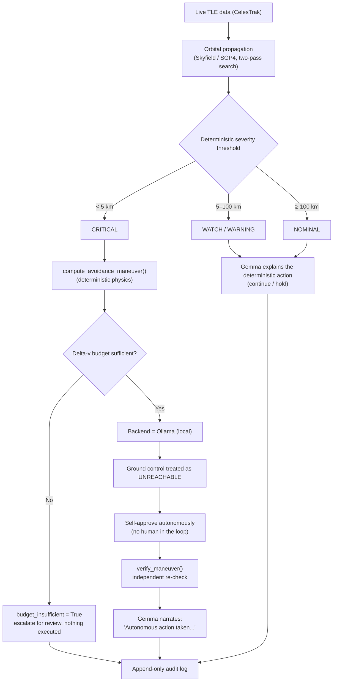
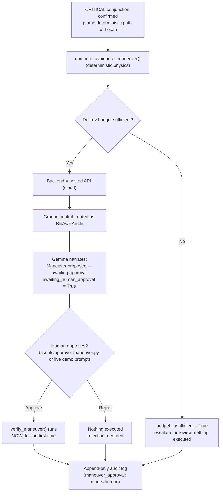

# Deep Space Navigation — Orbital Collision Avoidance

*Track 2 submission — Build with Gemma: Triage in Light Speed*

## The problem

Low Earth orbit is getting crowded. Thousands of tracked objects — active
satellites and debris from past collisions and breakups — are constantly
passing close to one another. A mission controller can't manually
evaluate every close approach in real time, but a wrong or opaque
automated call in this domain is genuinely dangerous: a missed collision
is catastrophic, a false alarm burns limited fuel, and a maneuver decision
nobody can explain afterward is a decision nobody can trust.

There's a second, quieter problem underneath that one: **ground control
isn't always reachable.** Light-speed delay and communication blackouts
are real constraints for anything operating in deep space — a probe often
has to decide *now*, not "as soon as someone signs off." A system that
only works when a human is watching isn't actually a deep-space system.

This project is an attempt to solve both problems in the same design:
**decisions that matter (is this dangerous? what should happen?) are made
deterministically, not by the AI** — and Gemma's job is to explain those
decisions in plain language, narrate what's happening, and — depending on
whether ground control is actually reachable — either report a completed
autonomous action, or clearly propose one and wait for a human.

## How it detects a collision risk

### The data

Real satellite/debris tracking data (TLEs — Two-Line Elements) is fetched
live from [CelesTrak](https://celestrak.org), currently sampling the
`cosmos-2251-debris` group — real fragments from the 2009 Cosmos
2251/Iridium 33 collision, one of the largest debris-generating events in
orbit. Nothing here is synthetic data dressed up as real; the WATCH/NOMINAL
conjunctions you'll see in a demo run are genuine predictions against
objects that are actually up there right now.

### The physics

Each pair of tracked objects is propagated forward with
[Skyfield](https://rhodesmill.org/skyfield/)'s SGP4 implementation — the
standard model for TLE-based orbit propagation — over a 48-hour lookahead
window. Finding the true closest approach isn't a single calculation: a
coarse sweep (5-minute steps) first brackets roughly where the minimum
separation falls, then a fine sweep (10-second steps) refines it within
that narrow window. This two-pass approach exists because a flat,
fixed-step sample can only ever find an *upper bound* on the real minimum
— the actual closest point can fall between samples. Relative velocity at
closest approach comes out of the same calculation.

### Turning physics into a decision

Severity is a **plain distance threshold**, not a model judgment call:

| Minimum predicted separation | Severity | Action |
|---|---|---|
| < 5 km | CRITICAL | abort (maneuver — see below) |
| 5 – 25 km | WARNING | hold |
| 25 – 100 km | WATCH | continue |
| ≥ 100 km | NOMINAL | continue |

Confidence isn't a fixed number either — it's derived from how *stale* the
underlying tracking data is (TLE epoch age): fresher data means a higher
confidence score, aging past a week drops it sharply. Gemma is only
brought in **after** severity and action are already decided, to turn the
raw numbers into a plain-language summary a person can actually read.

For a CRITICAL conjunction specifically, a simplified avoidance maneuver
(direction + delta-v) is computed deterministically, then **independently
re-verified** by re-deriving the resulting clearance forward from that
delta-v — not just trusting the number it was solved for. A limited
delta-v budget (a stand-in for real spacecraft fuel limits) is checked
before anything executes; if a maneuver would exceed what's left, the
system says so explicitly instead of silently continuing to act.

## Two decision paths: local autonomy vs. cloud-gated approval

The one piece of this system that genuinely *is* a judgment call — should
this maneuver execute right now, or should a human sign off first — is
resolved by which Gemma backend is configured, used deliberately as a
stand-in for whether ground control is reachable:

- **Local (Ollama)** → ground control **unreachable** → the maneuver is
  independently verified and self-approved immediately, no human in the
  loop.
- **Cloud (hosted API)** → ground control **reachable** → the maneuver is
  calculated and budget-checked, but held pending until a human explicitly
  approves or rejects it.

Gemma's role doesn't change between the two — it never decides the
physics, only narrates the current state (completed action vs. a proposal
awaiting approval). What changes is whether that action has actually
happened yet.

### Path 1 — Local (Ollama): autonomous

### Path 2 — Cloud (hosted API): human-in-the-loop

Both paths converge on the same audit log format — every entry records
whether its explanation actually came from Gemma or a deterministic
fallback, which backend produced it, and (for CRITICAL cases) whether the
maneuver was autonomous, human-approved, rejected, or blocked by budget.
Nothing about *how* a decision was reached is hidden after the fact.

## What the demo shows, step by step

`python scripts/run_demo.py` walks through all of this live, self-explained,
in order:

1. **Preflight check** — confirms which backend is configured, that it's
   actually reachable right now, and that the log directory is writable.
2. **Real orbital data** — a live CelesTrak fetch and real Skyfield/SGP4
   propagation, not simulated.
3. **CRITICAL conjunctions** — synthetic CRITICAL-range events (real data
   rarely lands there on demand) exercising maneuver calculation,
   verification, budget depletion, and — depending on this machine's
   backend — either autonomous execution or live human-approval prompts.
4. **Local/cloud failover** — proves the system recovers automatically if
   its primary Gemma backend becomes unreachable (skipped on a
   local-only machine, so a local demo never makes an unplanned cloud call).
5. **Human review** — marks a logged decision as reviewed, persisted to
   the actual audit file, not just held in memory.
6. **The audit trail itself** — reads back the real, raw, most recent log
   entry, showing every field described above populated for real.
7. **Automated test suite** — the full suite (network-free, mocked Gemma)
   runs live, proving none of the above happened without a safety net.
8. **Summary** — totals: severities seen, Gemma vs. fallback rationale,
   maneuvers executed (autonomous vs. human-approved) vs. blocked vs.
   rejected.

## Summary

- **Real data, real physics.** Live CelesTrak TLEs, Skyfield/SGP4
  propagation, a genuine two-pass closest-approach search — not mocked.
- **Reliability where it matters.** Severity, action, maneuver math, and
  budget enforcement are all deterministic; Gemma explains, it never
  decides.
- **An honest autonomy story.** Local vs. cloud isn't just an
  infrastructure choice here — it's used deliberately to model whether a
  human can actually be in the loop right now, with a real approval
  workflow (not a rubber stamp) when they can.
- **Nothing hidden.** Every decision, every provenance detail, every
  approval or rejection is written to an append-only audit log that can
  reconstruct exactly what happened and why, on its own, after the fact.
- **Verified, not just built.** 73 automated tests, plus every major path
  in this document has been run against real Ollama and a real hosted API
  key during development — not just asserted to work.

See [`DEMO.md`](DEMO.md) for exact commands and a deeper per-stage
breakdown, and [`PHASE_PROGRESS.md`](PHASE_PROGRESS.md) for the full build
history.
