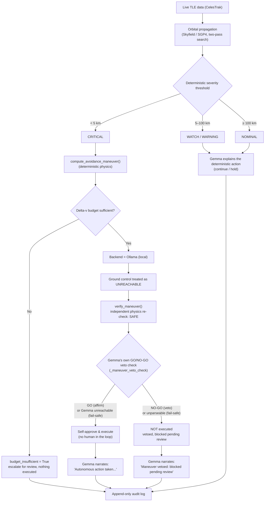
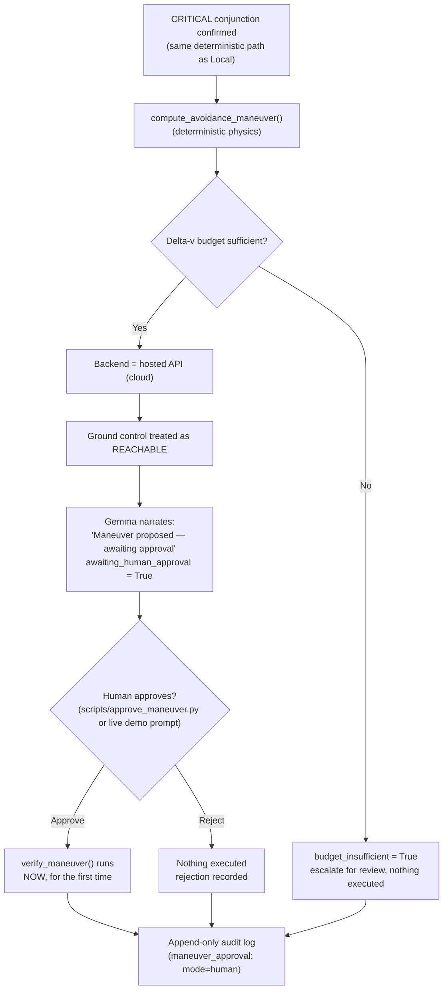

# Deep Space Navigation — Orbital Collision Avoidance

*Track 2 submission — Build with Gemma: Triage in Light Speed*

**Built with:** Python, [LangGraph](https://langchain-ai.github.io/langgraph/)
(pipeline orchestration), [Pydantic](https://docs.pydantic.dev/) (schema
validation), [Skyfield](https://rhodesmill.org/skyfield/)/SGP4 (real orbital
mechanics), [Ollama](https://ollama.com) (local Gemma) and a hosted
Gemini-style API (cloud Gemma), [Rich](https://rich.readthedocs.io/) (terminal UI),
[Streamlit](https://streamlit.io) (live mission-ops dashboard),
[Plotly](https://plotly.com/python/) (real 3D orbit visualization).

## The problem

Low Earth orbit is getting crowded. Thousands of tracked objects — active
satellites and debris from past collisions and breakups — are constantly
passing close to one another. A mission controller can't manually
evaluate every close approach in real time, but a wrong or opaque
automated call in this domain is genuinely dangerous: a missed collision
is catastrophic, a false alarm burns limited fuel, and a maneuver decision
nobody can explain afterward is a decision nobody can trust.

There's a second, quieter problem underneath that one: **ground control
isn't always reachable.** Light-speed delay and communication blackouts
are real constraints for anything operating in deep space — a probe often
has to decide *now*, not "as soon as someone signs off." A system that
only works when a human is watching isn't actually a deep-space system.

This project is an attempt to solve both problems in the same design:
**decisions that matter (is this dangerous? what should happen?) are made
deterministically, not by the AI** — and Gemma's job is to explain those
decisions in plain language, narrate what's happening, and — depending on
whether ground control is actually reachable — either report a completed
autonomous action, or clearly propose one and wait for a human.

## How it detects a collision risk

### The data

Real satellite/debris tracking data (TLEs — Two-Line Elements) is fetched
live from [CelesTrak](https://celestrak.org), by default from two real,
meaningfully different groups screened **against each other**: `stations`
(real crewed stations — ISS, Tiangong, ...) and `cosmos-2251-debris`
(real fragments from the 2009 Cosmos 2251/Iridium 33 collision, one of
the largest debris-generating events in orbit). Cross-screening both
answers the question that actually motivates collision avoidance — *is a
real active spacecraft at risk from real tracked debris?* — rather than
only debris-vs-debris. Nothing here is synthetic data dressed up as real;
the WATCH/NOMINAL/WARNING conjunctions you'll see in a demo run are
genuine predictions against objects that are actually up there right now.

Every pairwise conjunction across both groups is screened, not just a
handful — on a real ~120-object combined sample that's several thousand
pairs, checked end-to-end (including the live network fetch) in well
under a second. Naively re-propagating every pair from scratch doesn't
scale to that (measured at ~9.6s for just 1770 pairs during development);
each object's approximate trajectory is computed once and reused across
every pair it appears in, and only the closest candidates by that
estimate get the expensive precise refinement. See `PHASE_PROGRESS.md`
Phase 10 for the full performance approach and the two real issues
(docked-vehicle noise, a dense debris field crowding out cross-group
results) caught by actually running this live against CelesTrak, not just
in unit tests.

### The physics

Each pair of tracked objects is propagated forward with
[Skyfield](https://rhodesmill.org/skyfield/)'s SGP4 implementation — the
standard model for TLE-based orbit propagation — over a 48-hour lookahead
window. Finding the true closest approach isn't a single calculation: a
coarse sweep (5-minute steps) first brackets roughly where the minimum
separation falls, then a fine sweep (10-second steps) refines it within
that narrow window. This two-pass approach exists because a flat,
fixed-step sample can only ever find an *upper bound* on the real minimum
— the actual closest point can fall between samples. Relative velocity at
closest approach comes out of the same calculation.

### Turning physics into a decision

Severity is a **plain distance threshold**, not a model judgment call:

| Minimum predicted separation | Severity | Action |
|---|---|---|
| < 5 km | CRITICAL | abort (maneuver — see below) |
| 5 – 25 km | WARNING | hold |
| 25 – 100 km | WATCH | continue |
| ≥ 100 km | NOMINAL | continue |

Confidence isn't a fixed number either — it's derived from how *stale* the
underlying tracking data is (TLE epoch age): fresher data means a higher
confidence score, aging past a week drops it sharply. Gemma is only
brought in **after** severity and action are already decided, to turn the
raw numbers into a plain-language summary a person can actually read.

For a CRITICAL conjunction specifically, a simplified avoidance maneuver
(direction + delta-v) is computed deterministically, then checked twice
before being called verified: re-deriving the resulting clearance forward
from that delta-v (not just trusting the number it was solved for), and
a plausibility bound on the delta-v itself. Only the second one is
actually independent — a QA pass found the first is the algebraic
inverse of the original solve, so it's mathematically guaranteed to
agree and can only ever catch an implementation bug, not a bad maneuver.
See `src/maneuver.py:verify_maneuver`'s docstring and `PHASE_PROGRESS.md`'s
QA pass entry.

**Why there's a delta-v budget.** A real spacecraft doesn't have
unlimited fuel — it can't fire an avoidance maneuver every time one is
merely convenient. `DeltaVBudgetTracker` (`src/maneuver.py`) tracks a
starting delta-v allowance (`DELTA_V_BUDGET_M_S`, default 5.0 m/s) that
decrements every time a maneuver actually executes; when it can't cover a
new maneuver, `budget_insufficient` gets set to `True`. When a CRITICAL
maneuver can't be afforded, the system doesn't pretend to
have infinite fuel, and it doesn't fail silently either — the maneuver
plan stays visible (so a human can see what *would've* been needed),
`verified_clearance` stays empty (nothing was actually applied), and
Gemma's explanation says plainly that the maneuver was calculated but not
executed, and escalates for review. Failing transparently, not silently
or dishonestly, is the whole point.

## Two decision paths: local autonomy vs. cloud-gated approval

The one piece of this system that genuinely *is* a judgment call — should
this maneuver execute right now, or should a human sign off first — is
resolved by which Gemma backend is configured, used deliberately as a
stand-in for whether ground control is reachable:

- **Local (Ollama)** → ground control **unreachable** → a deterministic
  physics check independently verifies the maneuver is safe, then **Gemma
  itself gets those same numbers and issues a real GO/NO-GO verdict**,
  standing in for the unavailable human — no person in the loop.
- **Cloud (hosted API)** → ground control **reachable** → the maneuver is
  calculated and budget-checked, but held pending until a human explicitly
  approves or rejects it.

This is the one place Gemma's role genuinely changes between the two
paths. Everywhere else it never decides the physics, only narrates the
current state. On the local path specifically, Gemma *does* make a real
judgment call — but a tightly bounded one: it can only make the outcome
**more** conservative than the physics check, never less. It can veto an
already-verified-safe maneuver; it can never approve one the physics
hasn't already cleared. An unparseable verdict fails safe to NO-GO
(escalate), and Gemma being unreachable is *not* treated as a veto — an
LLM outage alone shouldn't block a maneuver already proven safe, so that
case still executes autonomously on the physics check alone.

### Path 1 — Local (Ollama): autonomous

### Path 2 — Cloud (hosted API): human-in-the-loop

Both paths converge on the same audit log format — every entry records
whether its explanation actually came from Gemma or a deterministic
fallback, which backend produced it, and (for CRITICAL cases) whether the
maneuver was autonomous, human-approved, rejected, or blocked by budget.
Nothing about *how* a decision was reached is hidden after the fact.

## Reliability layers: retry, failover, fallback, and review

Two more safety nets exist independently of the local/cloud approval
split above — worth calling out explicitly since they're easy to
conflate with it or with each other.

**Getting an explanation out of Gemma, in three tiers.** A single Gemma
call first retries once on the *same* backend (a transient hiccup
shouldn't force an immediate escalation). If that still fails,
`GemmaClient` **fails over** to the *other* configured backend (local ↔
cloud) and retries there. If *both* backends are unreachable, the
pipeline falls through to a **deterministic fallback** — a plain
templated sentence with no AI involved at all — so a finding or decision
is never silently dropped just because Gemma happens to be down. Every
logged entry records exactly which of these actually happened
(`GemmaProvenance.source`: `"gemma"` or `"fallback"`, plus `model_used`
naming the real backend/model that responded, even when it wasn't the one
originally configured).

**Two different kinds of "human," not one.** `human_reviewed` /
`reviewed_by` is a **post-hoc audit sign-off** — it can be applied to
*any* logged decision, at any time, after the fact (`scripts/mark_reviewed.py`).
It doesn't block or gate anything; it just records that a person looked
at it. `maneuver_approval` / `awaiting_human_approval` is a completely
different mechanism — a **pre-execution gate** that exists only for
CRITICAL maneuvers on the cloud backend, and actively prevents
`verify_maneuver()` from ever running until a person explicitly approves
or rejects it (`scripts/approve_maneuver.py`). A single decision can carry
both, neither, or just one of these — they're independent, and only one
of them (approval) can stop an action from happening.

## Live dashboard

`streamlit run scripts/dashboard.py` opens a browser-based mission-ops
view over the exact same append-only audit log the CLI writes to — not a
mock, not a second copy of the pipeline's decision logic:

- **Metrics row** — totals by state: executed autonomously, executed
  after human approval, vetoed by Gemma, rejected by a human, still
  awaiting approval, blocked by budget.
- **Pending human approval inbox** — every CRITICAL maneuver currently
  awaiting a decision, with real Approve/Reject buttons wired to
  `DecisionLogger.approve_maneuver` — clicking one actually resolves it,
  the same way `scripts/approve_maneuver.py` does.
- **Full decision table** and an **inspect/mark-reviewed panel** for any
  logged decision, wired to `DecisionLogger.mark_reviewed`.
- **Orbit plot** — for any real celestrak-sourced event, a real 3D view
  of both objects' actual propagated trajectories (Earth to scale, a
  closest-approach marker) plus a distance-vs-time chart with severity
  thresholds drawn in, built by re-fetching each object's current TLE and
  re-propagating with the same physics `src/orbital.py` already uses -
  see below.
- Three sidebar actions generate real new activity without leaving the
  browser: fetching live CelesTrak conjunctions (the same cross-group
  screening described above), running the synthetic CRITICAL fixture, and
  replaying a real historical collision (see below).

The dashboard's maneuver-state classification (which of the six states a
decision is in) reuses the exact same `classify_decision_status` function
the terminal renderer uses — the two views are structurally incapable of
disagreeing with each other about what state a decision is in.

### Orbit plot: seeing the real trajectories, not just the numbers

Selecting any `source="celestrak"` event in the inspect panel and
clicking "Generate orbit plot" re-fetches both objects' CURRENT TLEs by
NORAD catalog number and re-propagates them with the exact same
coarse-pass functions (`orbital.build_coarse_times`,
`orbital.compute_coarse_positions`) the real screening pipeline already
uses - no separate, duplicated physics. Renders a real interactive 3D
Plotly view (Earth drawn to scale, both objects' actual propagated
paths, a marker at the closest-approach point) and a distance-vs-time
chart with this project's own severity thresholds drawn as reference
lines.

Deliberately unavailable for synthetic or historical events - synthetic
fixtures have no real orbital elements, and (as established in Phase 12)
CelesTrak's public API only ever serves *current* TLEs, so a historical
event has no real archival trajectory to re-propagate either. The panel
says so explicitly rather than fabricating a plausible-looking plot.
Because it re-fetches *current* TLEs rather than the exact epoch that
produced the originally-logged `min_distance_km`, the plotted closest
approach can differ from what was logged at decision time - a live
recomputation, not a replay of the original numbers, and the UI says
that explicitly too.

## Historical replay: would this system have caught a real collision?

Everything else in this project runs on live or synthetic data.
`HistoricalReplayAdapter` (`src/ingestion/historical_adapter.py`) instead
replays a **real, documented** historical conjunction through the exact
same, unmodified pipeline — by default, the 2009 Iridium 33/Cosmos 2251
collision, the first confirmed accidental collision between two intact
satellites, and the same real event the `cosmos-2251-debris` data used
throughout this project traces back to.

The numbers aren't invented. CelesTrak's own historical account
([celestrak.org/events/collision](https://celestrak.org/events/collision/))
documents that its SOCRATES conjunction-screening system predicted a
**584m** closest approach in its final report before the collision
(issued 2009-02-10 15:02 UTC, predicted closest approach ~16:56 UTC the
same day) — and had predicted this same conjunction in **all 14 reports**
issued that week. It just never made the priority list (rank #152 that
day, out of a much larger set of predicted conjunctions industry-wide)
and nobody acted on it. **This was a triage failure, not a detection
failure** — a real, documented example of exactly the problem this
track's name names. NORAD catalog numbers, the ~11.7 km/s relative
velocity, and the ~789 km collision altitude were independently
corroborated against NASA/Wikipedia sources, not taken from one origin.

Feeding that real 584m number into this system's ordinary, unmodified
severity threshold (<5km = CRITICAL) classifies it as CRITICAL and
computes a maneuver — no special-casing for this being a replay. Try it:
`python scripts/run_demo.py` (Step 4) or the dashboard's "Replay
historical event" button.

## What the demo shows, step by step

`python scripts/run_demo.py` walks through all of this live, self-explained,
in order:

1. **Preflight check** — confirms which backend is configured, that it's
   actually reachable right now, and that the log directory is writable.
2. **Real orbital data** — a live CelesTrak fetch across real stations and
   real debris, cross-group screened, and real Skyfield/SGP4 propagation
   — not simulated, and not just a small staged pair.
3. **CRITICAL conjunctions** — synthetic CRITICAL-range events (real data
   rarely lands there on demand) exercising maneuver calculation,
   verification, budget depletion, and — depending on this machine's
   backend — either Gemma's own autonomous GO/NO-GO safety review
   (local) or live human-approval prompts (cloud).
4. **Historical replay** — the real 2009 Iridium 33/Cosmos 2251 collision
   record, fed through the same unmodified pipeline, proving the
   deterministic threshold would have classified it CRITICAL.
5. **Local/cloud failover** — proves the system recovers automatically if
   its primary Gemma backend becomes unreachable (skipped on a
   local-only machine, so a local demo never makes an unplanned cloud call).
6. **Human review** — marks a logged decision as reviewed, persisted to
   the actual audit file, not just held in memory.
7. **The audit trail itself** — reads back the real, raw, most recent log
   entry, showing every field described above populated for real.
8. **Automated test suite** — the full suite (network-free, mocked Gemma)
   runs live, proving none of the above happened without a safety net.
9. **Summary** — totals: severities seen, Gemma vs. fallback rationale,
   maneuvers executed (autonomous vs. human-approved) vs. blocked vs.
   rejected.

## Field glossary

The diagrams and audit log above use exact field names from the code —
here's what each one means, for reference:

| Field | Meaning |
|---|---|
| `Severity` | `nominal` / `watch` / `warning` / `critical` — deterministic, from distance thresholds |
| `Action` | `continue` / `hold` / `abort` — deterministic, mapped 1:1 from severity |
| `AnomalyFinding.confidence` | 0–1, derived from how stale the TLE tracking data is |
| `ManeuverPlan` | The deterministically computed direction + delta-v for a CRITICAL conjunction |
| `VerifiedClearance` | The independently re-derived post-maneuver separation, and whether it actually clears the threshold |
| `budget_insufficient` | `True` if the maneuver was calculated but couldn't be afforded from the remaining delta-v budget — nothing executed |
| `awaiting_human_approval` | `True` if the maneuver is calculated and affordable, but held pending a human decision (cloud backend only) |
| `ManeuverApproval.mode` | `"autonomous"` (local, no human — may still be a Gemma veto) or `"human"` (cloud, explicit approve/reject) |
| `GemmaProvenance.source` | `"gemma"` (real model output) or `"fallback"` (deterministic text — both backends were unreachable) |
| `veto_provenance` | Provenance for Gemma's own GO/NO-GO maneuver veto-check (local path, CRITICAL only) — `None` when no veto check was attempted |
| `human_reviewed` / `reviewed_by` | Post-hoc audit sign-off — independent of maneuver approval, applies to any decision |
| `object_a_group` / `object_b_group` | Which real CelesTrak group each object came from (e.g. `stations`, `cosmos-2251-debris`) — lets a cross-group "asset vs. debris" conjunction be told apart from a within-group one |
| `last_scan_stats` | `CelesTrakAdapter` instance attribute (not logged per-event) — what a screening call actually covered: `total_objects`, `total_pairs_screened`, `pairs_refined`, `cross_group_pairs_refined` |
| `source` (`TelemetryEvent`) | `"celestrak"` (real live), `"synthetic-critical-fixture"` (synthetic), or `"historical-replay"` (real, documented, but historical) — never ambiguous about which |
| `historical_event` / `historical_source` / `historical_actual_outcome` | Only present for historical replays — the citation and real-world outcome travel with the record itself, not just in documentation |

## Summary

- **Real data, real physics.** Live CelesTrak TLEs, Skyfield/SGP4
  propagation, a genuine two-pass closest-approach search — not mocked.
- **Reliability where it matters.** Severity, action, and maneuver math are
  100% deterministic — Gemma never computes or overrides them. The one
  bounded exception is the local-path veto check, and even there Gemma can
  only make an already-verified-safe maneuver *more* conservative, never
  less.
- **An honest autonomy story.** Local vs. cloud isn't just an
  infrastructure choice here — it's used deliberately to model whether a
  human can actually be in the loop right now: a real Gemma-driven safety
  review when they can't, a real human approval workflow (not a rubber
  stamp) when they can.
- **Nothing hidden.** Every decision, every provenance detail, every
  approval, veto, or rejection is written to an append-only audit log that
  can reconstruct exactly what happened and why, on its own, after the fact.
- **Proven against a real past failure, not just live/synthetic data.**
  The 2009 Iridium 33/Cosmos 2251 collision — a real, documented triage
  failure — classifies as CRITICAL through this system's ordinary,
  unmodified severity threshold, using the real 584m SOCRATES prediction.
- **Verified, not just built.** 128 automated tests, plus every major path
  in this document has been run against real Ollama, a real hosted API
  key, and real live CelesTrak data during development — not just
  asserted to work. The dashboard specifically was verified in a real
  browser against the real accumulated audit log, including clicking a
  real Approve button and confirming the resulting write to disk, and the
  3D orbit plot was confirmed rendering genuine elliptical paths by
  actually rotating it. On top of that, a full independent
  QA/gap-analysis/fresh-eyes review pass found and fixed 7 real issues
  after everything above was already "done" - see `PHASE_PROGRESS.md`'s
  QA pass entry.

Every phase originally scoped for this submission, plus the visual orbit
plot added afterward, is now built. Further ideas (multi-hazard triage
beyond conjunctions) remain open-ended, not tracked as committed next
steps.

See [`DEMO.md`](DEMO.md) for exact commands and a deeper per-stage
breakdown, and [`PHASE_PROGRESS.md`](PHASE_PROGRESS.md) for the full build
history.
