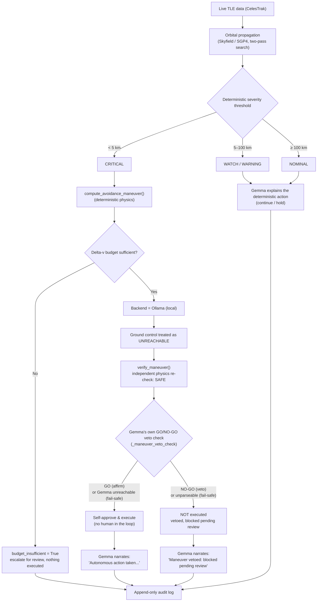
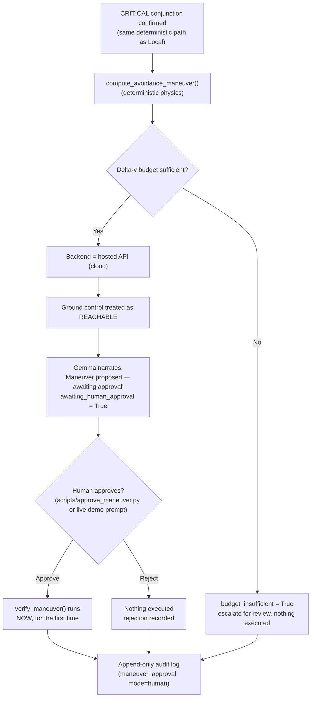

# Deep Space Navigation — Orbital Collision Avoidance

*Track 2 submission — Build with Gemma: Triage in Light Speed*

**Built with:** Python, [LangGraph](https://langchain-ai.github.io/langgraph/)
(pipeline orchestration), [Pydantic](https://docs.pydantic.dev/) (schema
validation), [Skyfield](https://rhodesmill.org/skyfield/)/SGP4 (real orbital
mechanics), [Ollama](https://ollama.com) (local Gemma) and a hosted
Gemini-style API (cloud Gemma), [Rich](https://rich.readthedocs.io/) (terminal UI).

## The problem

Low Earth orbit is getting crowded. Thousands of tracked objects — active
satellites and debris from past collisions and breakups — are constantly
passing close to one another. A mission controller can't manually
evaluate every close approach in real time, but a wrong or opaque
automated call in this domain is genuinely dangerous: a missed collision
is catastrophic, a false alarm burns limited fuel, and a maneuver decision
nobody can explain afterward is a decision nobody can trust.

There's a second, quieter problem underneath that one: **ground control
isn't always reachable.** Light-speed delay and communication blackouts
are real constraints for anything operating in deep space — a probe often
has to decide *now*, not "as soon as someone signs off." A system that
only works when a human is watching isn't actually a deep-space system.

This project is an attempt to solve both problems in the same design:
**decisions that matter (is this dangerous? what should happen?) are made
deterministically, not by the AI** — and Gemma's job is to explain those
decisions in plain language, narrate what's happening, and — depending on
whether ground control is actually reachable — either report a completed
autonomous action, or clearly propose one and wait for a human.

## How it detects a collision risk

### The data

Real satellite/debris tracking data (TLEs — Two-Line Elements) is fetched
live from [CelesTrak](https://celestrak.org), currently sampling the
`cosmos-2251-debris` group — real fragments from the 2009 Cosmos
2251/Iridium 33 collision, one of the largest debris-generating events in
orbit. Nothing here is synthetic data dressed up as real; the WATCH/NOMINAL
conjunctions you'll see in a demo run are genuine predictions against
objects that are actually up there right now.

### The physics

Each pair of tracked objects is propagated forward with
[Skyfield](https://rhodesmill.org/skyfield/)'s SGP4 implementation — the
standard model for TLE-based orbit propagation — over a 48-hour lookahead
window. Finding the true closest approach isn't a single calculation: a
coarse sweep (5-minute steps) first brackets roughly where the minimum
separation falls, then a fine sweep (10-second steps) refines it within
that narrow window. This two-pass approach exists because a flat,
fixed-step sample can only ever find an *upper bound* on the real minimum
— the actual closest point can fall between samples. Relative velocity at
closest approach comes out of the same calculation.

### Turning physics into a decision

Severity is a **plain distance threshold**, not a model judgment call:

| Minimum predicted separation | Severity | Action |
|---|---|---|
| < 5 km | CRITICAL | abort (maneuver — see below) |
| 5 – 25 km | WARNING | hold |
| 25 – 100 km | WATCH | continue |
| ≥ 100 km | NOMINAL | continue |

Confidence isn't a fixed number either — it's derived from how *stale* the
underlying tracking data is (TLE epoch age): fresher data means a higher
confidence score, aging past a week drops it sharply. Gemma is only
brought in **after** severity and action are already decided, to turn the
raw numbers into a plain-language summary a person can actually read.

For a CRITICAL conjunction specifically, a simplified avoidance maneuver
(direction + delta-v) is computed deterministically, then **independently
re-verified** by re-deriving the resulting clearance forward from that
delta-v — not just trusting the number it was solved for.

**Why there's a delta-v budget.** A real spacecraft doesn't have
unlimited fuel — it can't fire an avoidance maneuver every time one is
merely convenient. `DeltaVBudgetTracker` (`src/maneuver.py`) tracks a
starting delta-v allowance (`DELTA_V_BUDGET_M_S`, default 5.0 m/s) that
decrements every time a maneuver actually executes; when it can't cover a
new maneuver, `budget_insufficient` gets set to `True`. When a CRITICAL
maneuver can't be afforded, the system doesn't pretend to
have infinite fuel, and it doesn't fail silently either — the maneuver
plan stays visible (so a human can see what *would've* been needed),
`verified_clearance` stays empty (nothing was actually applied), and
Gemma's explanation says plainly that the maneuver was calculated but not
executed, and escalates for review. Failing transparently, not silently
or dishonestly, is the whole point.

## Two decision paths: local autonomy vs. cloud-gated approval

The one piece of this system that genuinely *is* a judgment call — should
this maneuver execute right now, or should a human sign off first — is
resolved by which Gemma backend is configured, used deliberately as a
stand-in for whether ground control is reachable:

- **Local (Ollama)** → ground control **unreachable** → a deterministic
  physics check independently verifies the maneuver is safe, then **Gemma
  itself gets those same numbers and issues a real GO/NO-GO verdict**,
  standing in for the unavailable human — no person in the loop.
- **Cloud (hosted API)** → ground control **reachable** → the maneuver is
  calculated and budget-checked, but held pending until a human explicitly
  approves or rejects it.

This is the one place Gemma's role genuinely changes between the two
paths. Everywhere else it never decides the physics, only narrates the
current state. On the local path specifically, Gemma *does* make a real
judgment call — but a tightly bounded one: it can only make the outcome
**more** conservative than the physics check, never less. It can veto an
already-verified-safe maneuver; it can never approve one the physics
hasn't already cleared. An unparseable verdict fails safe to NO-GO
(escalate), and Gemma being unreachable is *not* treated as a veto — an
LLM outage alone shouldn't block a maneuver already proven safe, so that
case still executes autonomously on the physics check alone.

### Path 1 — Local (Ollama): autonomous

### Path 2 — Cloud (hosted API): human-in-the-loop

Both paths converge on the same audit log format — every entry records
whether its explanation actually came from Gemma or a deterministic
fallback, which backend produced it, and (for CRITICAL cases) whether the
maneuver was autonomous, human-approved, rejected, or blocked by budget.
Nothing about *how* a decision was reached is hidden after the fact.

## Reliability layers: retry, failover, fallback, and review

Two more safety nets exist independently of the local/cloud approval
split above — worth calling out explicitly since they're easy to
conflate with it or with each other.

**Getting an explanation out of Gemma, in three tiers.** A single Gemma
call first retries once on the *same* backend (a transient hiccup
shouldn't force an immediate escalation). If that still fails,
`GemmaClient` **fails over** to the *other* configured backend (local ↔
cloud) and retries there. If *both* backends are unreachable, the
pipeline falls through to a **deterministic fallback** — a plain
templated sentence with no AI involved at all — so a finding or decision
is never silently dropped just because Gemma happens to be down. Every
logged entry records exactly which of these actually happened
(`GemmaProvenance.source`: `"gemma"` or `"fallback"`, plus `model_used`
naming the real backend/model that responded, even when it wasn't the one
originally configured).

**Two different kinds of "human," not one.** `human_reviewed` /
`reviewed_by` is a **post-hoc audit sign-off** — it can be applied to
*any* logged decision, at any time, after the fact (`scripts/mark_reviewed.py`).
It doesn't block or gate anything; it just records that a person looked
at it. `maneuver_approval` / `awaiting_human_approval` is a completely
different mechanism — a **pre-execution gate** that exists only for
CRITICAL maneuvers on the cloud backend, and actively prevents
`verify_maneuver()` from ever running until a person explicitly approves
or rejects it (`scripts/approve_maneuver.py`). A single decision can carry
both, neither, or just one of these — they're independent, and only one
of them (approval) can stop an action from happening.

## What the demo shows, step by step

`python scripts/run_demo.py` walks through all of this live, self-explained,
in order:

1. **Preflight check** — confirms which backend is configured, that it's
   actually reachable right now, and that the log directory is writable.
2. **Real orbital data** — a live CelesTrak fetch and real Skyfield/SGP4
   propagation, not simulated.
3. **CRITICAL conjunctions** — synthetic CRITICAL-range events (real data
   rarely lands there on demand) exercising maneuver calculation,
   verification, budget depletion, and — depending on this machine's
   backend — either Gemma's own autonomous GO/NO-GO safety review
   (local) or live human-approval prompts (cloud).
4. **Local/cloud failover** — proves the system recovers automatically if
   its primary Gemma backend becomes unreachable (skipped on a
   local-only machine, so a local demo never makes an unplanned cloud call).
5. **Human review** — marks a logged decision as reviewed, persisted to
   the actual audit file, not just held in memory.
6. **The audit trail itself** — reads back the real, raw, most recent log
   entry, showing every field described above populated for real.
7. **Automated test suite** — the full suite (network-free, mocked Gemma)
   runs live, proving none of the above happened without a safety net.
8. **Summary** — totals: severities seen, Gemma vs. fallback rationale,
   maneuvers executed (autonomous vs. human-approved) vs. blocked vs.
   rejected.

## Field glossary

The diagrams and audit log above use exact field names from the code —
here's what each one means, for reference:

| Field | Meaning |
|---|---|
| `Severity` | `nominal` / `watch` / `warning` / `critical` — deterministic, from distance thresholds |
| `Action` | `continue` / `hold` / `abort` — deterministic, mapped 1:1 from severity |
| `AnomalyFinding.confidence` | 0–1, derived from how stale the TLE tracking data is |
| `ManeuverPlan` | The deterministically computed direction + delta-v for a CRITICAL conjunction |
| `VerifiedClearance` | The independently re-derived post-maneuver separation, and whether it actually clears the threshold |
| `budget_insufficient` | `True` if the maneuver was calculated but couldn't be afforded from the remaining delta-v budget — nothing executed |
| `awaiting_human_approval` | `True` if the maneuver is calculated and affordable, but held pending a human decision (cloud backend only) |
| `ManeuverApproval.mode` | `"autonomous"` (local, no human — may still be a Gemma veto) or `"human"` (cloud, explicit approve/reject) |
| `GemmaProvenance.source` | `"gemma"` (real model output) or `"fallback"` (deterministic text — both backends were unreachable) |
| `veto_provenance` | Provenance for Gemma's own GO/NO-GO maneuver veto-check (local path, CRITICAL only) — `None` when no veto check was attempted |
| `human_reviewed` / `reviewed_by` | Post-hoc audit sign-off — independent of maneuver approval, applies to any decision |

## Summary

- **Real data, real physics.** Live CelesTrak TLEs, Skyfield/SGP4
  propagation, a genuine two-pass closest-approach search — not mocked.
- **Reliability where it matters.** Severity, action, and maneuver math are
  100% deterministic — Gemma never computes or overrides them. The one
  bounded exception is the local-path veto check, and even there Gemma can
  only make an already-verified-safe maneuver *more* conservative, never
  less.
- **An honest autonomy story.** Local vs. cloud isn't just an
  infrastructure choice here — it's used deliberately to model whether a
  human can actually be in the loop right now: a real Gemma-driven safety
  review when they can't, a real human approval workflow (not a rubber
  stamp) when they can.
- **Nothing hidden.** Every decision, every provenance detail, every
  approval, veto, or rejection is written to an append-only audit log that
  can reconstruct exactly what happened and why, on its own, after the fact.
- **Verified, not just built.** 87 automated tests, plus every major path
  in this document has been run against real Ollama and a real hosted API
  key during development — not just asserted to work.

**What's next:** ideas for further phases — screening the live CelesTrak
catalog for real current conjunctions instead of a staged pair, a visual
dashboard, historical replay against a real past close-approach event —
are tracked in `PHASE_PROGRESS.md`, not yet committed to.

See [`DEMO.md`](DEMO.md) for exact commands and a deeper per-stage
breakdown, and [`PHASE_PROGRESS.md`](PHASE_PROGRESS.md) for the full build
history.
